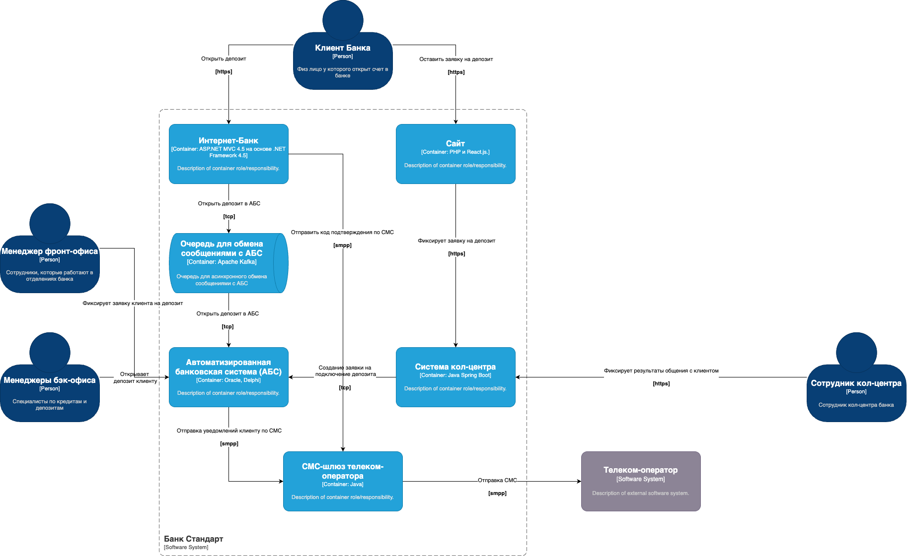
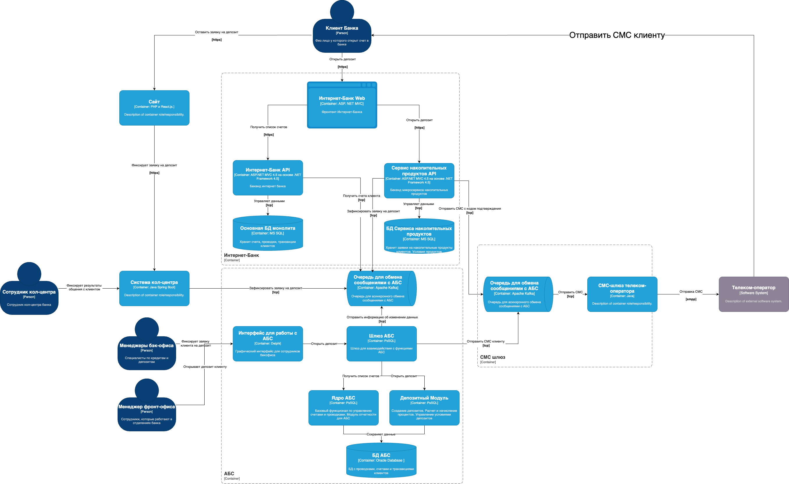

### **Название задачи:** Открытие депозитов онлайн

### **Автор:** Волков А. М.

### **Дата:** 30.03.2025

### **Функциональные требования**

| **№** | **Действующие лицо или система**                 | **Use Case**                   | **Описание**                                                                                                                                                                                                                                 |
|:-----:|:-------------------------------------------------|:-------------------------------|:---------------------------------------------------------------------------------------------------------------------------------------------------------------------------------------------------------------------------------------------|
|  UC1  | Клиент, Интернет-Банк (ИБ)                       | Открытие депозита              | 1. Клиент вводит номер счета, сумму и категорию тарифа.   2. ИБ отправляет клиенту СМС с кодом подтверждения.   3. Клиент подтверждает действие по СМС.   4. ИБ отправляет заявку в бекфоис. Клиенту отображает статус "Ожидайте"   |
|  UC2  | Клиент, Сайт                                     | Подача заявки на депозит       | 1. Клиент вводит ФИО и номер телефона на сайте   2. Бекенд сайта передаёт заявку в систему кол-центра                                                                                                                                     |
|  UC3  | Сотрудник кол-центра, Система кол-центра, АБС    | Обработка заявки с сайта       | 1. Клиент подает заявку с сайта   2. Сотрудник кол-центра звонит клиенту и рассказывает об условиях по депозиту   3. Сотрудник фиксирует результат общения с клиентом в системе кол-центра   4. Заявка на депозит фиксируется в АБС |
|  UC4  | Менеджер бек-офиса, АБС, Интернет-Банк, СМС шлюз | Подтверждение условий депозита | 1. Сотрудник обрабатывает заявку, назначает ставку в АБС   2. АБС отправляет СМС оповещение клиенту   3. Интернет банк получает стаутс депозита из АБС и отображает клиенту                                                            |

### **Нефункциональные требования**

| **№** | **Требование**                                                                          |
|:-----:|:----------------------------------------------------------------------------------------|
|   1   | Обеспечение защиты данных с помощью SSL/TLS на веб-сайте и в интернет-банке             |
|   2   | Гарантия доступности интернет-банка и сайта на уровне 99.9%                             |
|   3   | Время отклика операций не превышает 1 секунды                                           |
|   4   | Горизонтальное масштабирование интернет-банка и вертикальное масштабирование АБС        |
|   6   | Применение технологического стека с внутренней экспертизой (Java, .NET, MS SQL, Oracle) |
|   8   | Поддержка микросервисной архитектуры для модуля открытия депозитов                      |

### **Решение**

#### Диаграмма контекста

#### Диаграмма контейнеров

#### Описание решения

1) На стороне ИБ разрабатываем микросервис для управления накопительными продутками (депозиты, накопительные счета)
2) Сервис имеет свою локальную копию данных со справочниками. Все справочники держит в кеше
3) Монолит имеет свою изолированную БД в которой хранит оснонвые данные по клиентам. Это дает возможность горизонтального масштабирования независимо от АБС а так же уменьшает время отклика 
4) Взаимодействие с СМС шлюзом асинхронное через очередь
5) Взаимодействие с АБС асинхронное через очередь. Это позволит балансировать нагрузку на АБС
6) На стороне АБС разрабатываем (а скорее покупаем у вендора) депозитный модуль которые реализует основную логику работы накопительных продуктов
7) Для устранения проблемы man in the middle между АБС и стороними системами вводим расчет хеша HMAС сообщения с заранее согласованым ключом. Серкетный ключ хранится в защищенном хранилище и подключается в приложения. АБС перед исполнением команды пересчитывает хеш сообщения на основании секретного ключа и сравнивает с тем что ей передали
8) Шлюз АБС осуществляет единую точку входа (паттер API Gateway) между разными модулями АБС
9) Шифрование https при общении сервисов вне довереной сети

### **Альтернативы**

1) Разработка модуля депозитов в рамках монолита а не микросервиса. Вместо того чтобы сразу разрабатывать микросервис можно для этапа MVP разработать модуль в рамках монолита. Это ускорит доставку ценности клиенту и обеспечит нужный уровень изоляции
2) Использование очереди на БД вместо kafka. Внедрение кафка может стать дорогостоящим и длительным мироприятием. Для ускорения дставки ценности можно использовать очередь на БД (MS SQL)
3) Код для подтверждения открытия депозита может отправлять АБС. Это избавит от необходимости интеграции с СМС шлюзом на этапе MVP

**Недостатки, ограничения, риски**

1) Потребуется проработать асинхронную событийную модель взаимодействия с АБС
2) Риски срыва сроков из-за изучения и внедрение новых технологий и подходов
