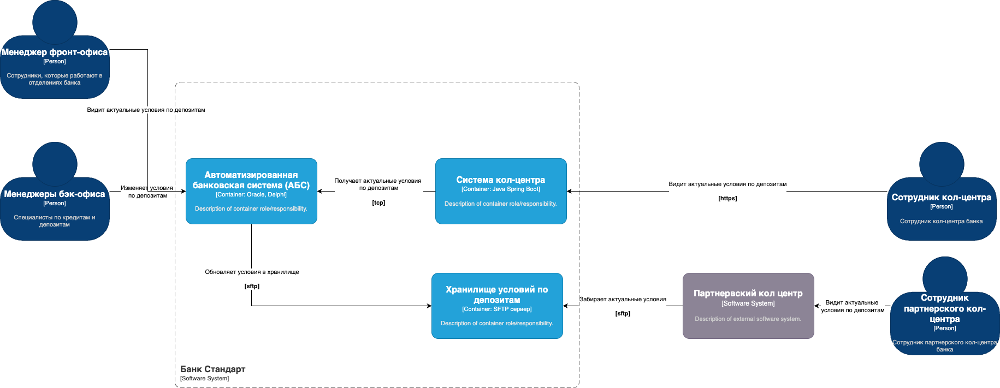
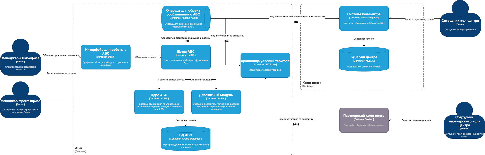

### **Название задачи:** Передача ставок в кол-центр

### **Автор:** Волков А. М.

### **Дата:** 30.03.2025

### **Функциональные требования**

| **№** | **Действующие лицо или система**                 | **Use Case**                   | **Описание**                                                                                                                                                                                                                                 |
|:-----:|:-------------------------------------------------|:-------------------------------|:---------------------------------------------------------------------------------------------------------------------------------------------------------------------------------------------------------------------------------------------|
|  UC1  | Сотрудник кол-центра, Система кол-центра                     | Получение текущим ставок по депозитам              | 1. Клиент звонит в кол центр и просит продиктовать ему актаульные условия депозита.   2. Сотрудник кол-центра получает информацию о депозитах из единого источника  |
|  UC2  | Сотрудник партнерского кол центра, Партнерский кол центр    | Получение текущим ставок по депозитам для партнеров | 1. Клиент звонит в партнервский кол центр и просит продиктовать ему актаульные условия депозита   2. Сотрудник кол-центра получается информацию о депозитамх и озвучивает их клиенту.   3. Инорфмация о депозитах синхронизирована между кол центрами                                                                                                                                      |
|  UC3  | Сотрудник бэкофиса депозиты, АБС    | Актуализация условий депозитов	       | 1. Сотрудник бекофиса обновляет условия по депозитам   2. Информаия становится доступа для сотрудников кол центра   3. Не позднее чем через 24 часа после изменения условий они становятся доступными для сотрудников партнервского кол центра |                                                       

### **Нефункциональные требования**

| **№** | **Требование**                                                                          |
|:-----:|:----------------------------------------------------------------------------------------|
|   1   | Обмен с партнервским кол центром должен быть реализован через файловый обмен (SFTP, Почта) |
|   2   | Гарантия доступности на уровне 99.9%                             |
|   3   | Время отклика операций не превышает 1 секунды                                           |
|   4   | Применение технологического стека с внутренней экспертизой (Java, .NET, MS SQL, Oracle) |
|   5   | Поддержка микросервисной архитектуры для модуля открытия депозитов                      |

### **Решение**

#### Диаграмма контекста

#### Диаграмма контейнеров

#### Описание решения

1) Разрабатываем сервис - общее хранилище условий тарифов. SFTP сервер + java connector для kafka. Сервис получает обновления из Kafka и формирует файл с условиями депозитов для интеграторов
2) Система колл центра забирает условия по депоизтам по Kafka к себе в локальную БД

### **Альтернативы**

1) Сервис хранилище тарифов забирать условия напрямую из АБС по джобе, без кафки. Это ускорит доставку ценности, но затрудник поддержку в будущем
2) Превратить хранилище тарифов в полноценный микросервис с АПИ, более расширяемо в будущем но это усложнит разработку
3) Система кол центра может забирать условия напрямую из АБС, не через кафка

**Недостатки, ограничения, риски**

1) Поддержка SFTP сервера увилит нагрузку на Эксплуатацию. Необходимо будет настраивать мониторинг
2) Асинхронный обмен через файлы не позволит оперативно обмениваться информацией. Всегда будет задежрка обновления

**Крупные задачи для каждой системы**

1) АБС
- Настроить нотификации (триггер + таблица в БД) в АБС при измении условий депозитов в депозитном модуле АБС 
- Реализовать коннектор для Kafka для экспорта нотификаций в Kafka

2) Система кол-центра

- Реализовать интеграцию с событиями по обновлению условий депозитов. Обработка события в топкие + сохранение в локальной БД
- Доработать интерфейс для отображения условий по депозитам

3) Партнёрский кол-центр

- Реализовать интеграцию с sftp сервером. Прием файлов и парсинг
- Доработать интерфейс для отображения условий по депозитам

4) Управление IT (инфраструктура)

- Развернуть sftp сервер
- Настроить мониторинг сервера и аудит действий сотрудников и администоров на сервере